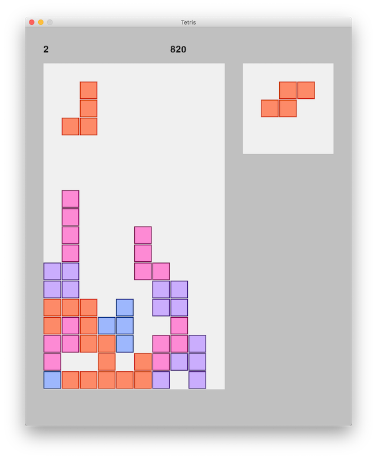

# Tetris

Everyone knows Tetris and I made this project to help further my learning and profficiency with Python.

I haven't tried to copy any particular version of Tetris, just the main functionality of the game.

## Build Status

This runs and is playable, but there are currently some bugs.

## Known Bugs

- Game crashed during level 2. 

- Sometimes (randomly it seems) the tetromino that is currently in play will zoom down to its resting place immediately after spawning without any input from the plater.

- Although the user is unable to direct the tetromino outside of the game area, the tetromino can spawn outside of it or halfway between the two.

- I attempted to create a Game Over message to show when the player lost the game but never got this working. Currently if you lose the game appears to freeze. 

- There is no way to start a new game while it's running. 

## Language

This was build with **Python 3** and the **Pygame** library.

## Dependencies

**Pygame1.9.2**

## Screenshots

 
